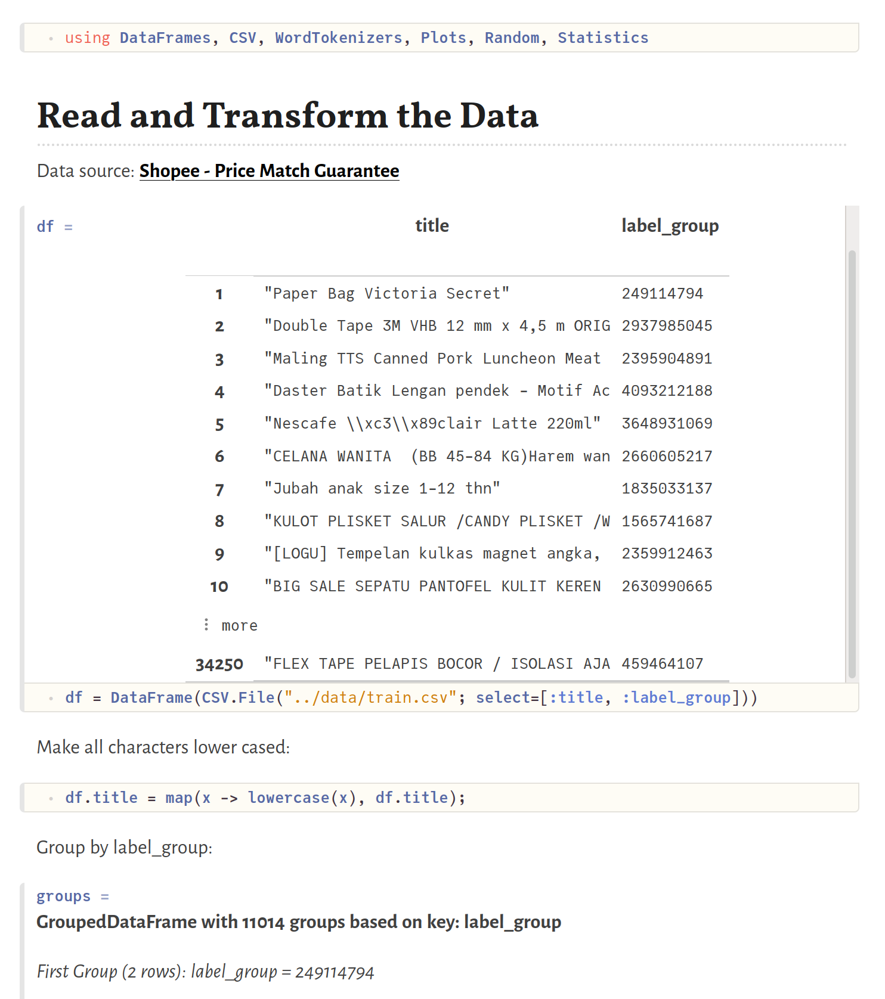



## Overview

I tried to conduct some exploratory analysis on the title field of the ["Shopee - Price Match Guarantee"](https://www.kaggle.com/c/shopee-product-matching) dataset. I wanted to know how similar the titles are within the same group, so we can have a rough idea of how useful the field would be in determining if two listings belong to the same group.

I used [StringDistances.jl](https://github.com/matthieugomez/StringDistances.jl) for raw string analysis and [WordToeknizers.jl](https://github.com/JuliaText/WordTokenizers.jl) for token analysis. Instead of using Jupyter Notebook, I used [Pluto.jl](https://github.com/fonsp/Pluto.jl) to get reactive notebooks with more presentably visual design right out of the box. The experience was a blast. Writing in Julia is not as hard as I expected, and the end result is very clean and blazing fast.

Pluto.jl notebooks are just `.jl` scripts. They are directly readable (unlike `.ipynb` format used by Jupyter, which is a JSON file) and easily sharable. It also supports HTML and PDF exports natively. You can find my notebook(s) created for this project below. (Note: currently, I have only cleaned and uploaded the token analysis one. I'll probably also upload the string analysis one later.)

### Token Analysis Example

* The `.jl` notebook file [on Github Gist](https://gist.github.com/ceshine/0a33de090ea66c6074d8719ead07ced1).
* The [HTML export](/htmls/pluto-shopee-2021-tokenized.html) of the notebook.

A screenshot:

