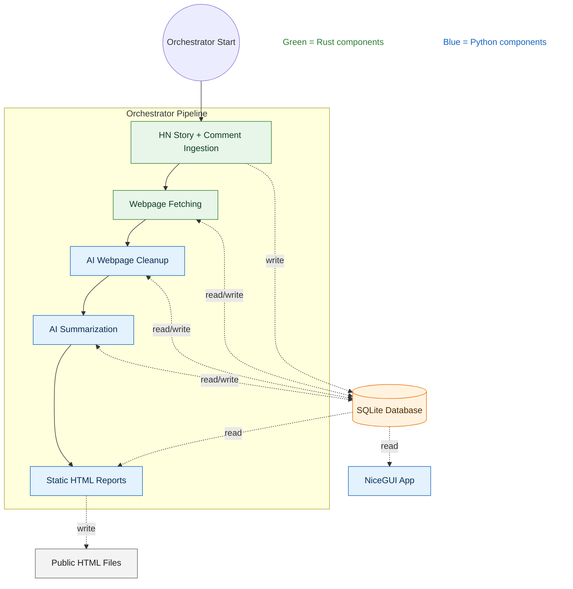
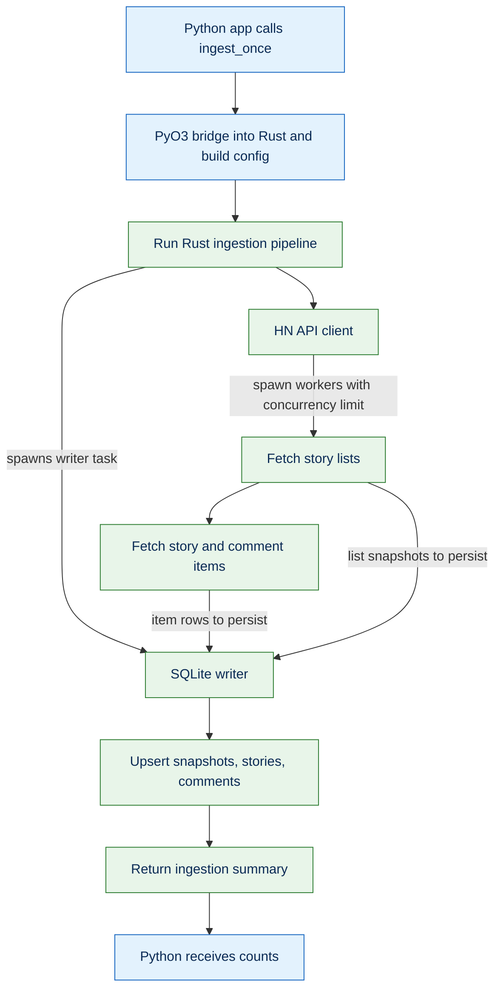
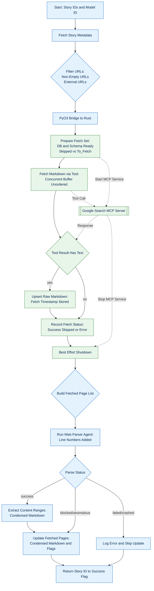
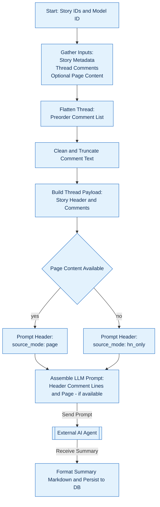
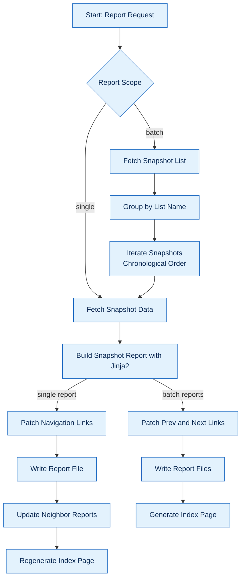



## Motivation

Reading trending threads on Hacker News is one of my favorite ways to discover interesting stories and read (mostly) thought-provoking discussions. Since reading all the top stories would be very time-consuming, I use web apps such as Gemini, Google AI Studio, and Claude to have an LLM agent automatically fetch web pages and summarize their content for me. I then quickly browse the summaries and decide which threads I want to read in full. This approach has been quite effective for me.

However, these AI apps are usually not very transparent about their use of tools. Sometimes they do not actually fetch the web page linked from a Hacker News story but instead infer the content from the Hacker News discussions. Sometimes they flat-out hallucinate without actually fetching anything from either Hacker News or the linked resource. Additionally, copying and pasting links to the top Hacker News stories is repetitive and should be easy to automate.

For these reasons, I decided to build my own little Hacker News Reader app that automatically fetches the Top and Best stories on Hacker News, retrieves the linked pages, summarizes the linked content and the Hacker News discussions, and presents the results as static HTML files through a deterministic workflow. It has been very helpful for me to see the big picture — to get a broader sense of which topics are being widely discussed, rather than semi-randomly picking a few threads to read.

Since the codebase for the app is not ready to open-source in the near future (I want to review it to avoid leaking any sensitive information), instead, I will write a blog post documenting the development of this app. Hopefully, someone will find it useful.

Please note that this blog post describes the latest version of the app as of early February 2026. This app may have been updated since then. I'll try to link to any subsequent blog posts — or the eventual open-source repository — here for your reference.

## Architecture Overview



There are four main components in this system:

1. **Hacker News Ingestor**: A multi-threaded Rust program that fetches Top and Best stories, the content of those stories, and the content of the comments on those stories from the Hacker News API.
2. **Web page fetcher and parser**: A hybrid program consisting of a Rust submodule that fetches the raw HTML from the URLs associated with the Hacker News stories, and a Python submodule that uses LLMs to extract the core content from the fetched HTML. The extraction phase removes noise that may distract the summarizer in the next step.
3. **Summarizer**: A Python program that uses LLMs to summarize the content of the stories and the comments on those stories.
4. **Report generator**: A Python program that generates a report for each specific Top and Best list of stories and an index of the reports. Each story includes a summary of the linked content and a summary of the discussion about the story.

The entire workflow is orchestrated by a Python script, and each component is executed in order. The data are stored in a local SQLite database. **Each job is scoped to a snapshot of the "top" and "best" story lists.** This allows us to resume an interrupted job by skipping stories and comments that have already been processed by each component.

The generated reports are self-contained HTML files. The index is also a self-contained HTML file. The reports and the index are available at [https://hnreader.ceshine.net/](https://hnreader.ceshine.net/) via [Cloudflare Pages](https://pages.cloudflare.com). This is a completely static website intended to minimize hosting costs and complexity.



In addition to the static reports, I have developed an interactive NiceGUI app, Visualizer, for internal testing purposes. The app exposes internal states stored in the local SQLite database. Because it exposes fetched web pages, I am not making the app publicly available.

We'll cover each component in more details in the next few sections.

(This system currently process only stories with a valid URL. Stories without links, such as Ask HN and Who's Hiring, are skipped for now.)

## Hacker News Ingestion



The Hacker News ingestion pipeline is implemented in Rust and is usually triggered from Python via the PyO3 bridge. The bridge builds the ingestion configuration that includes:

- Database path
- Story list selection (top or best)
- Limits for stories, comments, depth, and concurrency
- Rate limit settings

The Rust pipeline spawns multiple workers to fetch stories and comments asynchronously, with multiple workers running concurrently. The rate limit for the Hacker News API is implemented using a mutex that controls the minimum number of seconds between requests.

The pipeline first fetches the list of stories, processes the stories one by one, and collects their comments one level at a time (from the direct descendants to the deepest comment level defined in the configuration). Collected data is written to the database sequentially at the end of each step to avoid race conditions.

_Once the list of stories is persisted to the database as a snapshot, the ingestion process can be resumed, and all previously ingested stories and comments associated with this list will be overwritten by the upsert operations. This could cause time discrepancy issues if the process is resumed long after the snapshot was taken. Ideally, the entire ingestion pipeline should be treated as an atomic operation to avoid such issues. However, since retry attempts usually occur shortly after a failure, this is considered a reasonable trade-off between simplicity and correctness._

The Python caller of the ingestion pipeline receives a simple ingestion summary containing the snapshot timestamp, the number of stories in the list, and the number of items ingested or skipped for each item type.

## Web Page Fetching and Parsing



This component consists of two submodules: the Rust web page fetcher and the Python fetch-result parser. The two are connected by a Python orchestrator.

### Web Page Fetcher

I chose to implement the web page fetcher in Rust because of its superior concurrency control and high-performance multi-process management capabilities.

The fetcher currently runs the [Playwright MCP server](https://github.com/ceshine/python-playwright-google-search.git) I developed to fetch web pages. This MCP server has been used in my other projects and my daily LLM chat workflows, so incorporating it into this project creates minimal development friction (and it's free!). I may add support for commercial scraping APIs such as Jina's Reader API and the Firecrawl API in the future for pages and sites that do not play well with Playwright.

The MCP server supports concurrency, so the Rust fetcher can directly initiate multiple tool calls against a single MCP process, making the fetching process incredibly fast.

We use the `fetch_markdown` tool from the MCP server to collect the Markdown version of the fetched web page for brevity and readability.

The entire fetcher module is only 150 lines of code.

### Fetch Result Parser

Fetched web pages often contain a lot of irrelevant content, such as navigation headers, footers, advertisements, privacy notifications, and other elements. To prevent this content from distracting the summarizer, I added a fetch-result parser that utilizes LLMs to extract the main content from fetched web pages.

To avoid hallucinations from LLMs, instead of asking LLMs to repeat the main content, we attach a line number to each line of the fetched content and ask the LLM to extract the line numbers of the main content. While there may be incorrectly identified lines, the extracted content will always be verbatim from the fetched content, ensuring no hallucinations.

The LLMs are also tasked with determining two flags based on the input content: 'blocked' and 'anomalous'. The 'blocked' flag indicates cases where the fetch attempt is blocked by the website (usually resulting in an 'access denied' message or a CAPTCHA request). The 'anomalous' flag indicates cases where the fetched result does not seem relevant to the story's title (usually caused by page rendering issues).

Finally, we ask the LLMs to provide the reasoning for their decision. This helps us debug the results and, hopefully, improve the accuracy of the output.

Below is the part of the system prompt for the LLM that specifies the output format:

```markdown
Output format

- Return a single JSON object matching this schema exactly:
  - content_ranges: list of [start, end]
  - blocked: boolean
  - anomalous: boolean
  - reasoning: string
- Do not add any other keys.
```

You can find [the complete system prompt here](https://gist.github.com/ceshine/01316d53a030a88aec70738ea2cbb5ce).

If either of the two flags is raised in the LLM output, we will record the issue for the target URL in the database. Otherwise, we reconstruct the main content from the original fetch result and the LLM output and persist it to the database.

## Web Page Content and Discussion Summarizer



This is the last component in the system that writes to the database. The main task of this summarizer component is to synthesize a prompt that instructs the LLM to generate two summaries: one for the content of the linked web page and one for the Hacker News discussion thread.

Because the fetcher/parser component may fail to collect the content of the linked web page, we have a fallback that infers the post’s content from the discussion. We mark the normal mode with a `source_mode: page` line and the fallback mode with a `source_mode: hn_only` line. The system prompt contains instructions to handle both modes appropriately.

The ingested Hacker News comments are traversed in pre-order to mimic the presentation on the Hacker News website. Each comment is placed in the prompt as a single-line JSON object (one object per line).

Because the page content is optional, the prompt lists the comments first; it then appends the page content (if present) at the end.

This is the input format included in the system prompt:

```markdown
Title: <Story Title>
URL: <URL linked by the Story>
Descendants: <Number of comments under this story>
source_mode: [page | hn_only]

{"id": 9224, "parent_id": 8863, "depth": 0, "rank_in_parent": 1, "by": "user1", "time": 1175816820, "dead": false, "deleted": false, "text": "This is a top-level comment containing the full text..."}
{"id": 9272, "parent_id": 9224, "depth": 1, "rank_in_parent": 1, "by": "user2", "time": 1175822880, "dead": false, "deleted": false, "excerpt": "This is a nested reply containing only an excerpt..."}
... (one JSON object per line)

--- 

[The Page Content in Markdown when `source_mode` is `page`]
```

You can find [the complete system prompt here](https://gist.github.com/ceshine/293dea23ba53dcb02759b4612b3469d5).

Similar to the AI agent for the fetch result parser, the summarizer agent is required to produce structured output containing the two summaries we requested. The received output is briefly validated and then persisted to the database.

## Report Generator



This is the component I relied most heavily on AI to build, because I am not familiar with JavaScript. I intentionally avoided any complex JavaScript frameworks to minimize project complexity and reduce maintenance and hosting costs for the reports.

The Python report generation code relies on the Jinja2 templating engine. Each snapshot has its own self-contained HTML report. Generating the HTML report files is straightforward: we read the summary data from the database and let Jinja2 populate the templates. We optionally perform some post-processing on the summary data to inject links to the referenced Hacker News comments.

The tricky part comes when building the index page and the navigation links within each report page. We have two generation modes: "single" and "batch". The former generates a report for a single snapshot, while the latter generates reports for all snapshots in the database. The "single" mode requires finding the previous and next snapshots for the target snapshot. The navigation links in the reports for those neighboring snapshots may need to be updated. The "batch" mode is much more straightforward, as we can collect the list of snapshots in chronological order and process them one by one.

I use [Pico CSS](https://picocss.com/) for the UI and [Alpine.js](https://alpinejs.dev/) for dynamic behavior. The pages are uploaded and deployed to Cloudflare Pages via a single command: `npx wrangler pages deploy reports --commit-dirty=true`.

You can access the reports at [https://hnreader.ceshine.net](https://hnreader.ceshine.net).



## NiceGUI-based Visualizer

This is an internal application for validating intermediate database states and for my own use (e.g., generating a copy-ready prompt for each story so I can explore interesting stories further in a separate LLM thread). Below are some screenshots demonstrating the application's capabilities.









## Future Improvements

**A more intelligent comment ingestion strategy**:

Currently, the ingestion process is mainly controlled by two parameters: one controls the maximum depth of the comment tree that it traverses; the other controls the maximum number of child comments to be collected for each story or comment node. This may not be the best strategy for obtaining the most relevant comments. For example, we may want to go deeper for the first few child (first-level) comments of a story.

A thorough analysis of common patterns in the Hacker News discussion tree is needed to devise such a strategy.

**A more robust page fetcher**:

The MCP server currently in use does not handle CAPTCHAs for fetch requests the way it does for search requests. Improving the MCP server would help increase the number of pages that can be fetched. Alternatively, adding a second fetcher layer that relies on a commercial scraping API would also do the trick, albeit at some cost.

**Support concurrent AI agent requests**:

Currently, the fetch-result parser and the summarizer agents each handle one request at a time. This worked well during my initial development with local LLMs. However, when used with commercial LLM APIs, this approach misses the opportunity to use concurrent requests for significant performance gains. However, this increases the codebase's complexity.

**Provide search functionality for the summary reports**:

We could probably use Algolia’s free tier to provide simple search functionality for the static website. We could also build a simple search index for story titles and implement a self-contained HTML page to provide a more integrated experience.

## AI Use Disclosure

I rely heavily on the Codex CLI (GPT-5.2 Codex) to create Mermaid diagrams consistent with the codebase. I also used AI tools to revise the rest of the post, primarily for grammar and word choice. However, I wrote most of the content myself; it was not generated using prompts.

I developed the Hacker News reader mainly with assistance from the Gemini CLI (3 Pro Preview and 3 Flash Preview), occasionally using Codex CLI and OpenCode.

## Acknowledgments

This article helped me set up Mermaid diagram rendering on this website: [Getting Mermaid Diagrams Working in Hugo](https://blog.mikesahari.com/posts/hugo-mermaid-diagrams/)
