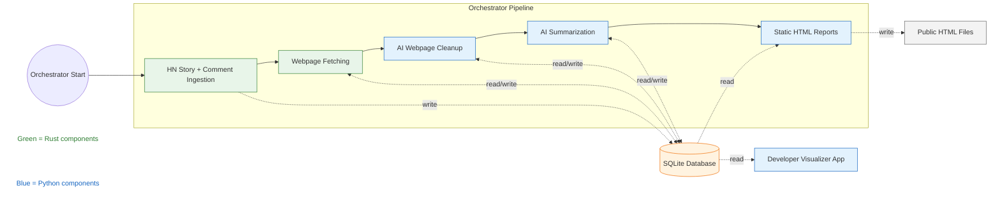

## Motivation

Reading trending threads on Hacker News is one of my favorite ways to discover interesting stories and read (mostly) thought-provoking discussions. Since reading all the top stories would be very time-consuming, I use web apps such as Gemini, Google AI Studio, and Claude to have an LLM agent automatically fetch web pages and summarize their content for me. I then quickly browse the summaries and decide which threads I want to read in full. This approach has been quite effective for me.

However, these AI apps are usually not very transparent about their use of tools. Sometimes they do not actually fetch the web page linked from a Hacker News story but instead infer the content from the Hacker News discussions. Sometimes they flat-out hallucinate without actually fetching anything from either Hacker News or the linked resource. Additionally, copying and pasting links to the top Hacker News stories is repetitive and should be easy to automate.

For these reasons, I decided to build my own little Hacker News Reader app that automatically fetches the Top and Best stories on Hacker News, retrieves the linked pages, summarizes the linked content and the Hacker News discussions, and presents the results as static HTML files through a deterministic workflow. It has been very helpful for me to see the big picture — to get a broader sense of which topics are being widely discussed, rather than semi-randomly picking a few threads to read.

Since the codebase for the app is not ready to open-source in the near future (I want to review it to avoid leaking any sensitive information), instead, I will write a blog post documenting the development of this app. Hopefully, someone will find it useful.

Please note that this blog post describes the latest version of the app as of early February 2026. This app may have been updated since then. I'll try to link to any subsequent blog posts — or the eventual open-source repository — here for your reference.

(Acknowledgement: This article helped me set up Mermaid rendering for this website — [Getting Mermaid Diagrams Working in Hugo](https://blog.mikesahari.com/posts/hugo-mermaid-diagrams/))

## Architecture Overview

