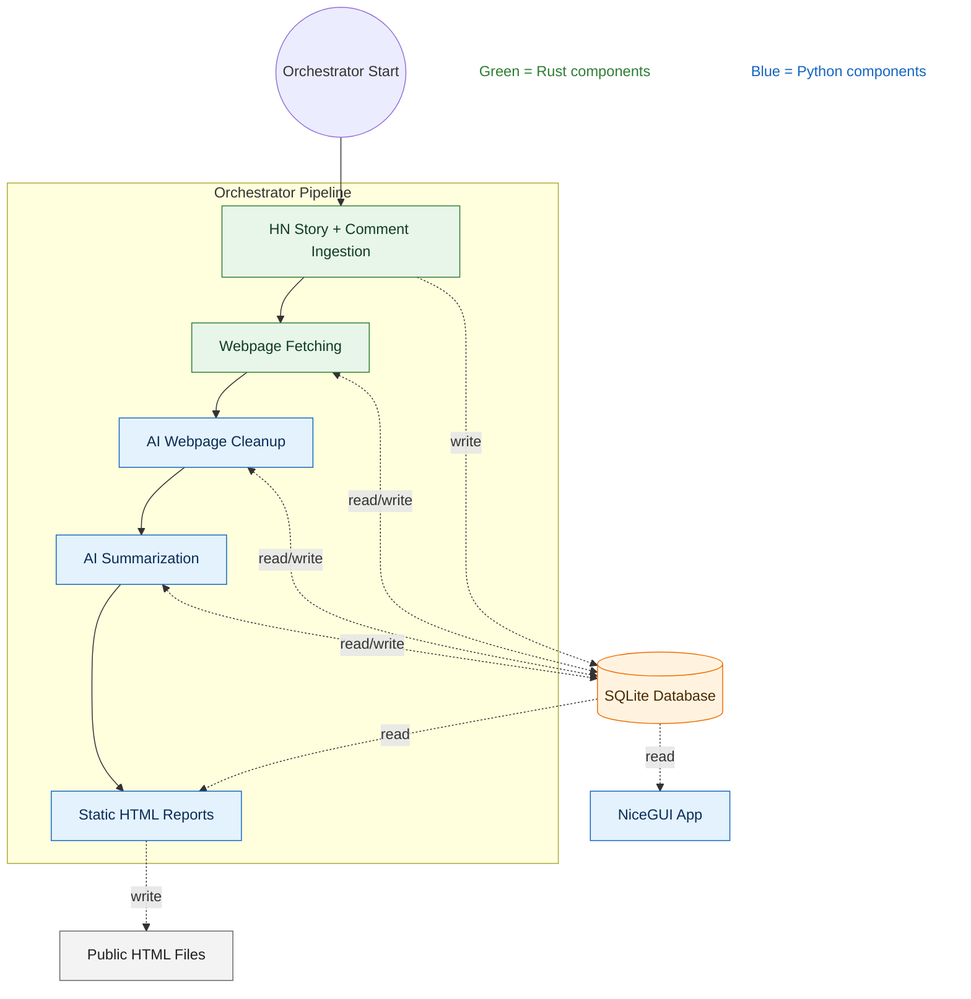
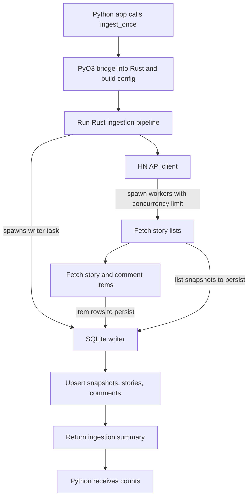



## Motivation

Reading trending threads on Hacker News is one of my favorite ways to discover interesting stories and read (mostly) thought-provoking discussions. Since reading all the top stories would be very time-consuming, I use web apps such as Gemini, Google AI Studio, and Claude to have an LLM agent automatically fetch web pages and summarize their content for me. I then quickly browse the summaries and decide which threads I want to read in full. This approach has been quite effective for me.

However, these AI apps are usually not very transparent about their use of tools. Sometimes they do not actually fetch the web page linked from a Hacker News story but instead infer the content from the Hacker News discussions. Sometimes they flat-out hallucinate without actually fetching anything from either Hacker News or the linked resource. Additionally, copying and pasting links to the top Hacker News stories is repetitive and should be easy to automate.

For these reasons, I decided to build my own little Hacker News Reader app that automatically fetches the Top and Best stories on Hacker News, retrieves the linked pages, summarizes the linked content and the Hacker News discussions, and presents the results as static HTML files through a deterministic workflow. It has been very helpful for me to see the big picture — to get a broader sense of which topics are being widely discussed, rather than semi-randomly picking a few threads to read.

Since the codebase for the app is not ready to open-source in the near future (I want to review it to avoid leaking any sensitive information), instead, I will write a blog post documenting the development of this app. Hopefully, someone will find it useful.

Please note that this blog post describes the latest version of the app as of early February 2026. This app may have been updated since then. I'll try to link to any subsequent blog posts — or the eventual open-source repository — here for your reference.

## Architecture Overview

There are four main components in this system:

1. **Hacker News Ingestor**: A multi-threaded Rust program that fetches Top and Best stories, the content of those stories, and the content of the comments on those stories from the Hacker News API.
2. **Web page fetcher and parser**: A hybrid program consisting of a Rust submodule that fetches the raw HTML from the URLs associated with the Hacker News stories, and a Python submodule that uses LLMs to extract the core content from the fetched HTML. The extraction phase removes noise that may distract the summarizer in the next step.
3. **Summarizer**: A Python program that uses LLMs to summarize the content of the stories and the comments on those stories.
4. **Report generator**: A Python program that generates a report for each specific Top and Best list of stories and an index of the reports. Each story includes a summary of the linked content and a summary of the discussion about the story.

The entire workflow is orchestrated by a Python script, and each component is executed in order. The data are stored in a local SQLite database. **Each job is scoped to a snapshot of the "top" and "best" story lists.** This allows us to resume an interrupted job by skipping stories and comments that have already been processed by each component.

The generated reports are self-contained HTML files. The index is also a self-contained HTML file. The reports and the index are available at [https://hnreader.ceshine.net/](https://hnreader.ceshine.net/) via [Cloudflare Pages](https://pages.cloudflare.com). This is a completely static website intended to minimize hosting costs and complexity.

In addition to the static reports, I have developed an interactive NiceGUI app, Visualizer, for internal testing purposes. The app exposes internal states stored in the local SQLite database. Because it exposes fetched web pages, I am not making the app publicly available.

We'll cover each component in more details in the next few sections.

(This system currently process only stories with a valid URL. Stories without links, such as Ask HN and Who's Hiring, are skipped for now.)

## Hacker News Ingestion

## Acknowledgments

This article helped me set up Mermaid diagram rendering on this website: [Getting Mermaid Diagrams Working in Hugo](https://blog.mikesahari.com/posts/hugo-mermaid-diagrams/)
