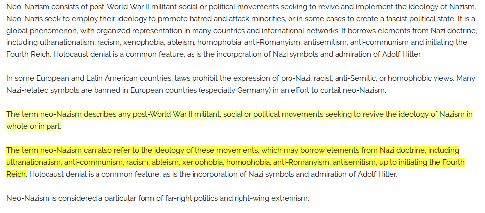



# Motivation

I’m trying to build a NLP system that can automatically highlight the important part of an article to help people to read long articles. The common practice is to start with a simple baseline model that is useful enough, and then incrementally improves the performance. The TextRank algorithm[1], which I also used as a baseline in a text summarization system, is a natural fit to this task.

# Available Implementations

There are multiple open-sourced Python implementations of TextRank algorithm, including [ceteri/pytextrank](https://github.com/ceteri/pytextrank), [davidadamojr/TextRank](https://github.com/davidadamojr/TextRank), and [summanlp/textrank](https://github.com/summanlp/textrank). They all come with different flavors of text pre-processings (for example, PyTextRank uses parts-of-speech tags to filter tokens, while summanlp’s version uses a list of stopwords), and output only the extracted sentences.

I need some ways to bypass the text pre-processing function so I can use my own pipeline for different languages such as Chinese and Japanese. And I need to get the internal data structure to be able to visualize it.

After some investigations, I decided that [summanlp/textrank](https://github.com/summanlp/textrank) was the easiest one for me to customize/extend (I really liked the abstraction of that project.).

The code used in this post has been open-sourced on Github, and comes with a simple web interface: **[ceshine/textrank_demo](https://github.com/ceshine/textrank_demo)**.

# How does TextRank work?

We’re going to focus on the sentence extraction part of the TextRank algorithm (i.e. ignoring the keyword extraction part). [This answer on Quora did a great job explaining the intuition behind the algorithm](https://www.quora.com/What-is-a-simple-but-detailed-explanation-of-Textrank), as quoted below:

> What TextRank does is very simple: **it finds how similar each sentence is to all other sentences in the text**. **The most important sentence is the one that is most similar to all the others**, with this in mind the similarity function should be oriented to the semantic of the sentence, cosine similarity based on a bag of words approach can work well and BM25/BM25+ work really nicely for TextRank.

Here are two good tutorials on TextRank algorithm: [Document Summarization using TextRank](https://joshbohde.com/blog/document-summarization/), [TextRank for Text Summarization](https://nlpforhackers.io/textrank-text-summarization/). Please refer to them, or even better, read the paper[1] if you want to know more about TextRank.

# An Example

We’re going to use the texts from the first two sections of the ["Neo-Nazism" entry on Wikipedia](https://www.wikiwand.com/en/Neo-Nazism) as an example to demonstrate the web interface and to visualize the associated internal graph created by TextRank.

An static snapshot of the web interface can be found here: **[Demo Page for TextRank Algorithm (EN)](https://publicb2.ceshine.net/file/ceshine-public/misc/textrank_demo.html)**.



The texts were split into 10 sentences, so there are 10 x 9 / 2 = 45 potential undirected connetctions between them. Only 29 of them has a weight larger than 0 (i.e. the sentences at both end of the edges are somewhat similar to each other). The similarity measure used here is the same as the original paper (something very similar to the [Jaccard similarity coefficient](https://www.wikiwand.com/en/Jaccard_index)):



However, the author [summanlp/textrank](https://github.com/summanlp/textrank) provided several other measures in various branches of the repository, such as BM25+ with correction.

## The Internal Graph



The above plot actually has some limited interactivity. Please visit the static snapshot page, or clone and run the code from your machine to make use of it.

We can see that the first sentence of the seventh paragraph has some strong similarity with P1S1, P1S4 and P5S1 nodes. It implies that the ideas in that sentences had been (partly or fully) mentioned several times in the article, therefore it is most likely the centerpiece of the article.

(Note: the paragraph count includes empty lines.)

## The Results

*The texts with the most two important sentences highlighted*

Looks reasonable enough. The highlighted sentences very broadly defines Neo-Nazism. Terms used in them frequently overlap the terms in other sentences.

## Future Work

It appears that we already have a decent baseline for Wikipedia-like articles. However, I did not include a proper stop list in the program, so it might work terribly with more casual texts. Using POS tags could actually be a better idea as it is more robust than a fixed stop word list.

Bypassing the built-in text pre-processing procedure has not been tried yet. It is required for the program to be able to process other languages that is not supported by `SnowballStemmer`. We need to create `SyntacticUnit` objects from raw texts by ourselves.

# The End

Thank you for reading! As TextRank is a fairly “old” algorithm by today’s standard, I wasn’t very sure how much efforts I need to put in to explain the algorithm. In the end I seem to have skipped most of the details.

The goal here is to provide a big picture and an example of how everything comes together for someone who is trying to quick build a baseline. I hope you find this post useful and worth your time (please give it some claps if you do). Thanks again for reading!

# 20181212 Update

I’m working on Chinese support, and have uploaded a very early version to the Github repo. You can check this file - *[text_cleaning_zh.py](https://github.com/ceshine/textrank_demo/blob/5c4bbd72e10cc2ca9f2c7dfa3a5efd0cbecd7e45/text_cleaning_zh.py)* - for an example of a custom pre-processing pipeline with a POS tag filter. I’d probably also add Japanese support as well if I can find a good and free Japanese POS tag filter.



# References

1. Mihalcea, R., Tarau, P.: [“Textrank: Bringing order into texts”](http://www.aclweb.org/anthology/W04-3252). In: Lin, D., Wu, D. (eds.) Proceedings of EMNLP 2004. pp. 404–411. Association for Computational Linguistics, Barcelona, Spain. July 2004.

1. Barrios, F., López, F., Argerich, L., Wachenchauzer, R.: [“Variations of the Similarity Function of TextRank for Automated Summarization”](https://arxiv.org/pdf/1602.03606.pdf). Anales de las 44JAIIO. Jornadas Argentinas de Informática, Argentine Symposium on Artificial Intelligence, 2015.